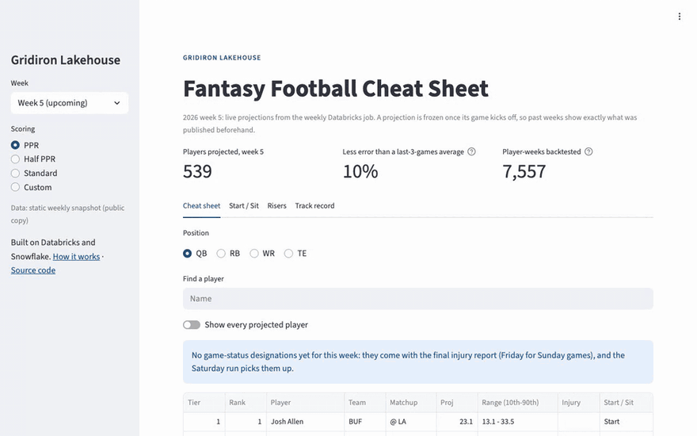

# Gridiron Lakehouse

Weekly fantasy football projections, built and backtested on Databricks and served from
Snowflake.

[](https://github.com/RettWilson22/gridiron-lakehouse/actions/workflows/ci.yml)
[](pyproject.toml)
[](LICENSE)
[](https://gridiron-lakehouse.streamlit.app)



**Live demo: https://gridiron-lakehouse.streamlit.app**, a public, read-only copy of the
Streamlit in Snowflake app. It reads a static snapshot of the marts exported from
Databricks and refreshed by hand; the Snowflake version needs a login.

## Results at a glance

Walk-forward backtest over the 2023-2025 seasons, scored on the players FantasyPros ranked
in each week's top 24 QBs, 48 RBs, 72 WRs and 24 TEs. Errors are PPR points per
player-week; rank correlation is Spearman's within each week, averaged over weeks.

| Position | MAE, model | MAE, best simple baseline | Rank correlation, model / experts | Inside the 10th-90th range |
| --- | --- | --- | --- | --- |
| QB | **6.37** | 6.66 (season average) | 0.308 / **0.314** | 77.5% |
| RB | **5.70** | 6.04 (season average) | 0.475 / **0.499** | 82.6% |
| WR | **5.79** | 6.17 (season average) | 0.433 / **0.458** | 83.5% |
| TE | **5.34** | 5.58 (season average) | 0.276 / **0.316** | 78.7% |

The model's point projections beat last-three-games and season-to-date averages at every
position. FantasyPros expert consensus still ranks players slightly better at every
position. Numbers are from the local `make model-local` run of 2026-10-09, saved in
[`artifacts/backtest_metrics.json`](artifacts/backtest_metrics.json). The app and the public
snapshot still show the earlier Databricks run, made before early stopping was switched
off, so their model numbers differ; they will match the method above after the next deploy
and job run. Method, per-season results and caveats:
[docs/methodology.md](docs/methodology.md).

## What this demonstrates

* **A Databricks-to-Snowflake handoff.** Databricks publishes six serving tables; a
  MERGE-based sync writes only the rows that changed into Snowflake, where a stream and
  task keep a projected-vs-actual scorecard current incrementally.
* **Leak-free features, with tests that try to break them.** Every feature uses only
  information from before kickoff. The tests scramble or drop future results, other weeks'
  injury reports and depth charts, and later weeks' rosters, and check that a week's
  features do not change.
* **Evaluation against real benchmarks.** A walk-forward backtest (each season projected by
  a model trained only on earlier seasons) against two simple baselines and FantasyPros
  expert rankings, rebuilt in dbt SQL and reconciled with the Python numbers by a test.
* **Everything as code.** A Databricks Asset Bundle (job, Lakeflow pipeline, schemas,
  volume); Snowflake SQL for the warehouse, cost monitor, roles, UDF, stream, task and app;
  DDL generated from the table contracts; a dbt project with Snowflake and DuckDB targets.
* **CI on every push to main.** Ruff, strict mypy, a generated-SQL freshness check, a dbt build and
  its tests on DuckDB fixtures, and 152 pytest tests, including the pipeline on local Spark
  and headless tests of the Streamlit app.

## Why both platforms?

Many companies run Databricks and Snowflake side by side, often owned by different teams:
data engineering and machine learning on Databricks, analytics and business-facing apps on
Snowflake. The hard part is the handoff between them. Here Databricks owns ingestion,
transformation and the model; Snowflake owns the analytics model, the SQL-callable scoring
logic, the incremental scorecard and the app. A single team starting from scratch could use
one platform; the point here is working across both.

## Architecture

```mermaid
flowchart LR
    subgraph Sources["Public sources (GitHub releases and repos)"]
        NV["nflverse<br/>pbp, stats, snaps, rosters, injuries,<br/>depth charts, schedules, players"]
        FF["ffverse ffopportunity<br/>expected fantasy points"]
        DP["DynastyProcess<br/>FantasyPros weekly ECR, id crosswalk"]
    end

    subgraph Databricks["Databricks Free Edition (serverless, Unity Catalog)"]
        direction TB
        ING["Task: ingest<br/>idempotent, content-addressed"]
        VOL[("UC volume<br/>landing/&lt;dataset&gt;/&lt;season&gt;")]
        subgraph LDP["Lakeflow Declarative Pipeline (one pipeline)"]
            BR["11 bronze streaming tables<br/>Auto Loader"]
            SI["silver materialized views<br/>newest file per season, expectations"]
            GO["gold: player_week, team_week,<br/>defense_vs_position, depth_chart_week"]
        end
        TR["Task: train<br/>walk-forward backtest, MLflow,<br/>UC model registry"]
        SC["Task: score<br/>upcoming week, tiers, start/sit,<br/>risers; frozen at kickoff"]
        PUB["Task: publish_serving<br/>UniForm tables in gridiron_serving"]
        ING --> VOL --> BR --> SI --> GO --> TR --> SC --> PUB
    end

    subgraph Snowflake["Snowflake (trial)"]
        direction TB
        SYN["SYNCED: native tables"]
        DBT["dbt: STAGING and MARTS<br/>cheat sheet, risers, scorecard"]
        UDF["Python UDF<br/>FANTASY_POINTS(stats, scoring)"]
        TASK["Stream + task<br/>APP.PROJECTION_RESULTS"]
        APP["Streamlit in Snowflake<br/>Fantasy Football Cheat Sheet"]
        SYN --> DBT --> APP
        SYN --> TASK
        UDF --> APP
    end

    PUBLIC["Public copy on Streamlit Community Cloud<br/>static Parquet snapshot of the marts"]

    NV --> ING
    FF --> ING
    DP --> ING
    PUB -- "scripts/sync_to_snowflake.py<br/>Arrow read + MERGE (production path)" --> SYN
    PUB -. "Iceberg REST catalog<br/>(needs external storage; not on Free Edition)" .-> SYN
    PUB -- "scripts/export_public_snapshot.py<br/>same dbt marts, built in DuckDB" --> PUBLIC
```



## How it works

**Databricks** (Free Edition, serverless). A five-task job runs Tuesday, Thursday and
Saturday at 12:00 UTC. `ingest` lands eleven public datasets in a Unity Catalog volume,
skipping completed seasons and unchanged files. One Lakeflow pipeline builds bronze (Auto
Loader), silver (typed, with data-quality expectations) and gold. `train` runs the
walk-forward backtest, fits a gradient-boosting model per position and stat-line component,
logs it to MLflow and registers it in Unity Catalog. `score` projects the upcoming week
with floors, ceilings, tiers and start/sit labels, and never replaces a projection once its
game has kicked off. `publish_serving` writes the six serving tables.

**The handoff.** `make sync` reads the serving tables through a Databricks SQL warehouse as
Arrow and MERGEs them into `GRIDIRON.SYNCED` with key-pair authentication. It runs from a
laptop, as do the dbt build and the public snapshot export.

**Snowflake** (trial, one X-Small warehouse under a resource monitor). dbt builds the marts
for the cheat sheet, risers, game logs and the accuracy record. `APP.FANTASY_POINTS` is a
Python UDF that rescores a stat line under any league's scoring, using the same
`scoring.py` as Databricks. Streams on `SYNCED.PLAYER_WEEK` and `SYNCED.PROJECTIONS` and a
task rebuild projected-vs-actual results only for weeks whose results or projections
changed. The Streamlit in Snowflake app has a cheat sheet, a player index, a start/sit
comparison, risers and a track record; the public copy runs the same code against a
Parquet snapshot of the marts. The player index search
([`player_search.py`](src/gridiron/player_search.py)) handles partial and last-name-first
queries, initials ("jsn"), nicknames ("cmc"), close spellings ("mccaffery") and team or
position words ("lions wr"), and ranks ties by this week's projection.

## Quickstart

Needs Python 3.12, Java 17 or newer (local Spark) and make.

```bash
make setup        # .venv with every extra
make check        # ruff, mypy, generated-SQL check, dbt build on DuckDB, pytest
make app-public   # the app on http://localhost:8501 against the committed snapshot
```

The full flow on real data and the cloud deployment are in [docs/deploy.md](docs/deploy.md).

## Key findings and limitations

* **Iceberg interoperability does not work on Databricks Free Edition.** Its metastore cannot
  grant `EXTERNAL USE SCHEMA`, and its Iceberg REST endpoint vends no storage credentials
  for tables on default storage, so the MERGE sync is the production path. The Iceberg SQL
  is kept for workspaces with external storage ([details](docs/deploy.md#the-iceberg-path-workspaces-with-external-storage)).
* **The backtest and live runs see different information.** Backtest features use closing
  lines and final injury reports, which the Tuesday and Thursday live runs do not have yet
  for Sunday games. The expert benchmark is the latest FantasyPros scrape on or before the
  week's last game day, so it can include news a Tuesday projection lacks. The backtest
  retrains once a season; the live model retrains every run.
* **Behind the experts on ranking.** The model has no news, beat reporting or view of
  coaching intent; from the injury report it uses only game status and practice
  participation.
* **The public demo is a static snapshot.** It changes only when the snapshot is exported
  from Databricks again and committed.
* **Scope.** Kickers and defenses are not modelled. Floors and ceilings come from PPR and
  are scaled for other formats, and yardage bonuses applied to an average stat line
  understate their value (the app says so).

## Documentation

* [docs/methodology.md](docs/methodology.md): data sources and their terms, candidates,
  features and leakage rules, the model, the backtest and full per-season results.
* [docs/deploy.md](docs/deploy.md): the full local flow, a from-scratch deployment on
  Databricks Free Edition and a Snowflake trial (including key pairs), the Iceberg path and
  cost notes.
* [docs/verification.md](docs/verification.md): what has been run locally and in the cloud,
  with dates and results.

## Repository layout

```
src/gridiron/        Shared Python package: ingest, transforms, features, model, backtest,
                     projections, scoring (also the Snowflake UDF), sync configuration
databricks/          Asset Bundle: job, pipeline, schemas, volume, job entry points
snowflake/           setup, sync DDL, Iceberg path, UDF, stream and task, dbt, the app
streamlit_public/    Public copy: entry point, requirements, snapshot
scripts/             Local runners, fixtures, SQL generation, sync, snapshot export
tests/               pytest suite and fixtures
artifacts/           Backtest metrics from the last local run
docs/                Methodology, deployment, verification, images
```

## License and data

The code is MIT licensed; see [LICENSE](LICENSE). The data belongs to its sources, and the
small slices of it checked in under `tests/fixtures/` and `streamlit_public/snapshot/` remain
under their terms:

* **nflverse** (play-by-play, player stats, snap counts, rosters, injuries, depth charts,
  schedules, players): [nflverse-data](https://github.com/nflverse/nflverse-data), CC-BY-4.0.
  Snap counts originate from Pro Football Reference; betting lines are as published in the
  nflverse schedules.
* **ffverse ffopportunity** (expected fantasy points):
  [ffverse/ffopportunity](https://github.com/ffverse/ffopportunity), GPL-3.0 repository.
* **DynastyProcess** (FantasyPros ECR history and the player id crosswalk):
  [dynastyprocess/data](https://github.com/dynastyprocess/data), GPL-3.0 repository. The
  rankings themselves are FantasyPros content; this project uses them as a benchmark, and the
  public snapshot does not republish them.
