# Gridiron Lakehouse

An end-to-end NFL fourth-down analytics platform split across two clouds the way many real
teams split them. Databricks ingests about 540,000 plays of public nflverse play-by-play
data, builds bronze, silver and gold tables with a Lakeflow Declarative Pipeline, and trains
and registers a fourth-down decision model with MLflow in Unity Catalog. Snowflake serves
the results: it reads the gold tables in place through Apache Iceberg (Delta UniForm plus
the Unity Catalog Iceberg REST catalog), models them with dbt, keeps a weekly summary
current with a stream and task, runs the model as a Python UDF, and puts it all in front of
users in a Streamlit in Snowflake app. The question it answers: on fourth down, did the
coach make the call that a simple expected-points model would have made, and which teams
leave the most points on the table?

> Status: everything that can run without cloud accounts has been built and run locally
> (see [What was verified locally](#what-was-verified-locally)). The Databricks and
> Snowflake deployment steps are written out below but have not been run yet; results from
> the first cloud run are marked "to be filled in".

## Why both platforms?

Many companies run Databricks and Snowflake side by side, often owned by different teams:
data engineering and machine learning on Databricks, analytics and business reporting on
Snowflake. The hard part is the handoff between them. This project shows that handoff done
properly: Snowflake reads the Databricks tables in place through Apache Iceberg, with no
duplicate copies and no nightly export job. For a single team starting from scratch, one
platform would be enough; the point here is working across both.

## Architecture

```mermaid
flowchart LR
    subgraph Source
        NV["nflverse GitHub releases<br/>play_by_play_{season}.parquet"]
    end

    subgraph Databricks["Databricks (Free Edition, serverless, Unity Catalog)"]
        direction TB
        ING["Job task: ingest<br/>idempotent, content-addressed"]
        VOL[("UC volume<br/>landing/pbp")]
        subgraph LDP["Lakeflow Declarative Pipeline"]
            BR["bronze_plays<br/>streaming table, Auto Loader"]
            SI["plays (silver)<br/>typed, de-duplicated, expectations"]
            GO["gold materialized views<br/>fourth_down_decisions, team_season_summary, game_summary"]
        end
        ML["Job task: train_and_score<br/>scikit-learn + MLflow, UC model registry"]
        PUB["Job task: publish_serving<br/>UniForm (IcebergCompatV2) tables"]
        IRC{{"Unity Catalog<br/>Iceberg REST catalog"}}
        ING --> VOL --> BR --> SI --> GO --> ML --> PUB --> IRC
    end

    subgraph Snowflake["Snowflake (trial)"]
        direction TB
        ICE["ICEBERG_RAW: Iceberg tables<br/>catalog integration, vended credentials"]
        SYN["SYNCED: native tables<br/>(fallback path)"]
        DBT["dbt: STAGING and MARTS"]
        ST["Stream + task<br/>weekly summary"]
        UDF["Python UDF<br/>FOURTH_DOWN_RECOMMENDATION"]
        APP["Streamlit in Snowflake<br/>Fourth Down Explorer"]
        ICE --> DBT
        SYN --> DBT
        SYN --> ST
        DBT --> APP
        UDF --> APP
    end

    NV --> ING
    IRC -- "Iceberg metadata + data files<br/>(no copy)" --> ICE
    PUB -. "scripts/sync_to_snowflake.py<br/>(fallback: MERGE copy)" .-> SYN
```



### What each platform does, and why

| Platform | Responsibility | Why it lives there |
| --- | --- | --- |
| Databricks | Ingestion, bronze/silver/gold transformation, data-quality expectations, model training, model registry, scoring | Spark and Lakeflow pipelines are built for incremental file ingestion and multi-stage transformation; MLflow and the Unity Catalog model registry come with the platform. |
| Snowflake | Serving and analytics: dbt marts, incremental weekly aggregates, a SQL-callable model, the end-user app, cost controls | SQL warehouses that suspend after 60 seconds, simple role-based access for analysts, and an app runtime (Streamlit) next to the data. |
| Apache Iceberg | The contract between them | Snowflake reads the same Parquet files Databricks wrote. No export job, no second copy, one source of truth. |

## How the Iceberg interoperability works

1. **UniForm on plain Delta tables.** Delta UniForm writes Iceberg metadata alongside the
   Delta log, so the same Parquet files are readable as an Iceberg table. The table
   properties (`src/gridiron/serving.py`) are `delta.enableIcebergCompatV2 = true`,
   `delta.universalFormat.enabledFormats = iceberg`, `delta.columnMapping.mode = name`, and
   `delta.enableDeletionVectors = false` (Iceberg reads cannot be enabled on tables with
   deletion vectors).
2. **Why a separate serving schema.** `IcebergCompatV2` cannot be enabled on materialized
   views or streaming tables, which is what a Lakeflow pipeline produces. The
   `publish_serving` job task therefore copies each gold dataset into an ordinary managed
   Delta table in `gridiron_serving`. That schema is also the only one the Snowflake
   principal is granted `EXTERNAL USE SCHEMA` on, which keeps external access narrow.
   (Databricks also offers a newer, preview-stage external access feature for pipeline
   datasets; this project does not depend on it.)
3. **Stable table identity.** Serving tables are created once and refreshed with
   `INSERT OVERWRITE`, not `CREATE OR REPLACE`, so each table keeps its identity in the
   catalog and Snowflake's Iceberg tables keep pointing at it.
4. **Unity Catalog as the Iceberg REST catalog.** Snowflake's catalog integration
   (`CATALOG_SOURCE = ICEBERG_REST`) points at
   `https://<workspace>/api/2.1/unity-catalog/iceberg-rest`. With
   `ACCESS_DELEGATION_MODE = VENDED_CREDENTIALS`, Unity Catalog hands Snowflake short-lived
   storage credentials per table, so no Snowflake external volume or cloud IAM setup is
   needed.
5. **Snowflake side.** Externally managed Iceberg tables in `ICEBERG_RAW` (with
   `AUTO_REFRESH`) are wrapped in views with upper-case column names in `ICEBERG`, because
   Unity Catalog identifiers are lower case. dbt reads from those views.
6. **Fallback path.** If external data access is not available on the workspace (see
   [Limitations](#limitations-and-open-questions)), `scripts/sync_to_snowflake.py` reads
   the same serving tables through a Databricks SQL warehouse and MERGEs them into native
   tables in `SYNCED`, which expose identical columns. dbt switches with one variable:
   `--vars '{gold_source: synced}'`.

## Data model

| Layer | Dataset | Grain | Notes |
| --- | --- | --- | --- |
| Bronze | `bronze_plays` | play x landed file version | Auto Loader streaming table over the volume; all ~370 source columns plus `_ingested_at`, `_source_file` |
| Silver | `plays` | play (`game_id`, `play_id`) | 41 typed columns; latest ingested version wins; drop rules on keys, warn rules on ranges |
| Gold | `fourth_down_decisions` | fourth-down snap | go / punt / field goal, outcome, game context, coach |
| Gold | `team_season_summary` | team x season | EPA per play, success rate, go rate, conversion rate |
| Gold | `game_summary` | game | final score, winner, fourth-down choices by side |
| Gold (ML) | `fourth_down_scored` | fourth-down snap | option values, recommendation, expected points lost |
| Gold (ML) | `coach_aggressiveness` | team x season | go rate when the model said go, expected points lost |
| Snowflake | `MARTS.MART_FOURTH_DOWN_LEADERBOARD` | team x season | league-relative aggressiveness and decision-quality ranks |
| Snowflake | `MARTS.MART_TEAM_TRENDS` | team x season | season-over-season change, coach changes |
| Snowflake | `MARTS.MART_FOURTH_DOWN_CALLS` | fourth-down snap | each call classified against the model |
| Snowflake | `APP.WEEKLY_FOURTH_DOWN_SUMMARY` | team x week | maintained incrementally by a stream and task |

## The fourth-down model

Deliberately simple and transparent (`src/gridiron/decision.py`, `src/gridiron/training.py`):

* **Conversion probability**: logistic regression on `log1p(ydstogo)`, `yardline_100`,
  goal-to-go, score differential and minutes remaining, trained on every fourth-down
  attempt. This is the model tracked in MLflow and registered in Unity Catalog as
  `<catalog>.<schema>.fourth_down_conversion` with the `champion` alias.
* **Field goal make probability**: logistic regression on kick distance.
* **Expected points of a first down at each yardline**: the average of nflfastR's `ep` over
  first-down snaps, lightly smoothed.
* **Punt result**: average opponent field position after a punt from each yardline.

Each option is valued in expected points for the offense. Going for it is
`P(convert) * EP(first down at the line to gain, or a touchdown) + (1 - P) * -EP(opponent
ball at the same spot)`; field goals and punts are valued the same way. The recommendation
is the option with the highest value, and "expected points lost" is how far the actual call
was below the best one. Evaluation is temporal: train on 2015-2023, test on the completed
2024 and 2025 seasons. The fitted model exports to a small JSON file, which is what the
Snowflake UDF and the app evaluate, so all three implementations share one artifact (a unit
test checks that the UDF reproduces the Python model).

## Local results

All numbers below were produced on a laptop by `make ingest pipeline-local train-local`
on 2026-10-08, using nflverse data for the 2015 through 2026 seasons (2026 through week 4).
They are local results, not Databricks results. The full metrics and the calibration table
are in [`artifacts/local_training_metrics.json`](artifacts/local_training_metrics.json).

**Pipeline volumes**: 543,531 plays (no duplicate keys; every silver warn rule had zero
violations), 44,256 fourth-down decisions, 3,092 games, 384 team-seasons. The local Spark
run of the full transformation took about 20 seconds.

**Conversion model, held-out 2024-2025** (1,746 attempts; trained on 5,814):

| Model | AUC | Brier | Log loss |
| --- | --- | --- | --- |
| Logistic regression, 5 features | 0.660 | 0.2257 | 0.6429 |
| Baseline: `log1p(ydstogo)` only | 0.657 | 0.2257 | 0.6429 |

Read honestly: distance to go carries almost all of the signal; field position, score and
clock add very little. The model is also slightly under-confident on recent seasons: the
observed conversion rate in the test set was 56.1% against a mean prediction of about
53.6%, consistent with conversion rates rising over time.

**Field goal model, held-out 2024-2025** (2,087 attempts): AUC 0.748, Brier 0.115.

**What the model says**: in neutral situations (win probability 10-90%, at least five
minutes left) it recommends going for it on 46.3% of fourth downs; coaches went for it on
11.8%. Expected-points models are known to be more aggressive than win-probability models,
and the conversion model is fit only on plays where coaches chose to go (see limitations),
so treat the absolute rate with care; the comparison between teams is the more robust use.
Teams that went for it most often when the model said go: in 2024 Detroit (58.1%),
Buffalo and Chicago; in 2025 Buffalo (52.6%), Detroit and the Rams.

**Cloud results**: to be filled in after the first cloud run (pipeline run time on
serverless, MLflow run and registered model version, Snowflake query timings, credits used).

## Repository layout

```
.
├── src/gridiron/              Shared Python package (unit tested)
│   ├── config.py              Source URL, season range, silver column contract
│   ├── ingest.py              Idempotent, content-addressed season downloads
│   ├── transforms.py          Bronze/silver/gold PySpark functions
│   ├── quality.py             Expectation rules shared by pipeline and tests
│   ├── features.py            Model features and temporal split
│   ├── decision.py            Decision model, scoring, aggressiveness
│   ├── training.py            Fitting and evaluation
│   ├── serving.py             UniForm serving-table SQL
│   ├── snowflake_sql.py       Snowflake DDL / MERGE generation
│   └── sync_config.py         Environment-based sync configuration
├── databricks/                Databricks Asset Bundle
│   ├── databricks.yml         Bundle, variables, dev/prod targets
│   ├── resources/             Schemas and volume, pipeline, job
│   ├── pipelines/             Lakeflow pipeline definition (wiring only)
│   └── jobs/                  ingest, train_and_score, publish_serving
├── snowflake/
│   ├── setup/                 Warehouse, resource monitor, roles, schemas
│   ├── iceberg/               Catalog integration, Iceberg tables, views
│   ├── sync/                  Native tables for the fallback path
│   ├── streams_tasks/         Stream + task, and the dynamic-table alternative
│   ├── snowpark/              Python UDF and its registration SQL
│   ├── dbt/                   dbt project (Snowflake targets + DuckDB CI target)
│   └── streamlit/             Streamlit in Snowflake app
├── scripts/                   Local runners, fixture builder, SQL generator, sync
├── tests/                     pytest suite and fixtures (three real games)
└── artifacts/                 Exported decision model and local metrics
```

## Running locally

Requirements: Python 3.12, Java 17 or newer (for local Spark), make.

```bash
make setup            # .venv with all extras
make check            # ruff, mypy, generated-SQL check, dbt build on DuckDB, pytest

# Full local run on real data (about 230 MB downloaded into the git-ignored data/ folder)
make ingest           # 2015 through the current season; re-running skips completed seasons
make pipeline-local   # Spark transformations -> data/lakehouse/*.parquet
make train-local      # model training, held-out metrics, scored tables
make smoke-jobs       # runs the Databricks job entry points against local Spark tables
make dbt-local        # dbt marts over the full local data in DuckDB
make app              # Streamlit app on http://localhost:8501, backed by DuckDB
```

`make fixtures` rebuilds the checked-in test fixtures (three complete games: 2023 LV at DET,
2024 DET at GB, 2024 MIN at DET) and the generated Snowflake DDL.

### What was verified locally

* `ruff check`, `ruff format --check` and `mypy` (strict mode) pass.
* 69 pytest tests pass, including: ingestion idempotency against a fake remote; every
  transformation on the fixture; de-duplication keeping the latest ingested version; the
  pipeline file's dataset wiring and expectations (with a stand-in for the Databricks-only
  `pyspark.pipelines` expectation decorators); model fitting and JSON round trip; UDF parity
  with the Python model on 300 random situations; sync configuration and SQL generation;
  and a headless Streamlit `AppTest` that renders every tab against the dbt DuckDB build.
* `dbt build --target ci` passes all 44 nodes on the fixtures, and the same project builds
  with every test passing over the full local dataset.
* The ingest job ran for real against GitHub twice; the second run skipped every completed
  season and found the current season unchanged.
* `scripts/smoke_databricks_jobs.py` ran `train_and_score` (MLflow logging to a local file
  store, registration skipped) and `publish_serving` (twice, to exercise the refresh path)
  against a local Spark catalog.
* The Streamlit app was run locally and every tab checked in a browser.
* The full check suite was re-run from a fresh clone in a new virtualenv, as CI does.

Not verified (needs cloud accounts): `databricks bundle validate/deploy`, the pipeline on
serverless, Auto Loader, Unity Catalog model registration, UniForm metadata generation, the
Snowflake catalog integration, and every `.sql` file under `snowflake/`.

## Deploying to Databricks (Free Edition)

1. Sign up for Databricks Free Edition and open the workspace. Note the workspace URL.
2. Install a recent Databricks CLI and authenticate:
   ```bash
   databricks auth login --host https://<your-workspace-host>
   ```
3. Validate, deploy and run the bundle from the `databricks/` folder:
   ```bash
   cd databricks
   databricks bundle validate -t dev
   databricks bundle deploy -t dev
   databricks bundle run -t dev gridiron_refresh
   ```
   The dev target prefixes resource names, including the schemas, with `dev_<user>_`.
   Deploy with `-t prod` for the unprefixed `gridiron` and `gridiron_serving` schemas that
   the Snowflake scripts assume. The first run downloads every season; later runs only
   refresh the current one.
4. If the ingest task cannot reach GitHub (Free Edition limits outbound internet to a set
   of trusted domains), land the files from your laptop instead (adjust the schema name for
   the dev prefix):
   ```bash
   make ingest
   databricks fs cp -r data/landing dbfs:/Volumes/workspace/gridiron/landing/pbp
   ```
   Then use **Repair run** on the failed job run in the Jobs UI to run `transform` and the
   tasks after it.
5. Check the results: the pipeline graph and expectation metrics in the pipeline UI, the
   MLflow experiment `/Users/<you>/gridiron-fourth-down`, the registered model under
   Catalog > workspace > gridiron > Models, and the five tables in `gridiron_serving`.
6. For Snowflake's Iceberg access: enable **External data access** on the metastore
   (requires a metastore admin), create a personal access token (or a service principal
   with an OAuth secret), and grant the principal:
   ```sql
   GRANT USE CATALOG ON CATALOG workspace TO `<principal>`;
   GRANT USE SCHEMA, EXTERNAL USE SCHEMA, SELECT ON SCHEMA workspace.gridiron_serving TO `<principal>`;
   ```
7. For the fallback sync only: note a SQL warehouse's server hostname and HTTP path.

## Deploying to Snowflake (trial)

Run the scripts in this order in a Snowsight SQL worksheet (or with SnowSQL / the Snowflake
CLI from the repository root, which the `PUT` commands require):

| Step | Script | Role |
| --- | --- | --- |
| 1 | `snowflake/setup/01_warehouse_and_monitor.sql` | ACCOUNTADMIN |
| 2 | `snowflake/setup/02_database_and_roles.sql` | ACCOUNTADMIN |
| 3a | `snowflake/iceberg/01_catalog_integration.sql` (fill in the placeholders) | ACCOUNTADMIN |
| 3b | `snowflake/iceberg/02_iceberg_tables.sql` | GRIDIRON_ADMIN |
| 3c | `snowflake/iceberg/03_iceberg_views.sql` | GRIDIRON_ADMIN |
| 4 | Fallback only: `snowflake/sync/01_synced_tables.sql`, then `make sync` | GRIDIRON_ADMIN, then GRIDIRON_LOADER |
| 5 | `snowflake/snowpark/01_create_udf.sql` | GRIDIRON_ADMIN |
| 6 | dbt (below) | GRIDIRON_TRANSFORMER |
| 7 | `snowflake/streams_tasks/01_weekly_summary_stream_task.sql` (synced path) or `02_weekly_summary_dynamic_table.sql` (Iceberg path) | GRIDIRON_ADMIN |
| 8 | `snowflake/streamlit/01_create_streamlit.sql` | GRIDIRON_ADMIN |

Placeholders in step 3a: `<DATABRICKS_HOST>`, `<DATABRICKS_CATALOG>` (`workspace` on Free
Edition), `<DATABRICKS_SERVING_SCHEMA>` (`gridiron_serving`) and `<DATABRICKS_PAT>`. The
script ends with `SYSTEM$VERIFY_CATALOG_INTEGRATION`, which should succeed before moving on.

For the fallback sync, generate a key pair for the `GRIDIRON_SYNC` service user and put the
connection settings in a git-ignored `.env` (template: `.env.example`):

```bash
openssl genrsa 2048 | openssl pkcs8 -topk8 -inform PEM -out rsa_key.p8 -nocrypt
openssl rsa -in rsa_key.p8 -pubout -out rsa_key.pub
# In Snowflake: ALTER USER GRIDIRON_SYNC SET RSA_PUBLIC_KEY = '<rsa_key.pub without the header lines>';
make sync
```

dbt, either from a laptop or as a dbt Project on Snowflake:

```bash
# From a laptop (pip install dbt-snowflake; reads SNOWFLAKE_* variables from the environment)
cd snowflake/dbt
dbt build --target snowflake --profiles-dir .                                  # Iceberg path
dbt build --target snowflake --profiles-dir . --vars '{gold_source: synced}'   # fallback path

# As a dbt Project on Snowflake with the Snowflake CLI; uses dbt_projects_profiles.yml
snow dbt deploy gridiron_dbt --source snowflake/dbt --database GRIDIRON --schema APP
snow dbt execute gridiron_dbt build
# or in SQL: EXECUTE DBT PROJECT GRIDIRON.APP.GRIDIRON_DBT ARGS = 'build --target prod';
```

The project uses the `arguments:` form for generic tests, so the Snowflake dbt runtime must
be 1.10.15 or newer (for example 1.11.11, pinned with `DBT_VERSION`) if your account
default is older. `SELECT SYSTEM$SUPPORTED_DBT_VERSIONS();` lists what is available.

## Cost notes

* **Databricks Free Edition** has no charges; it enforces a daily fair-use compute quota
  instead. The job uses serverless compute only, one pipeline (Free Edition allows one
  active pipeline per type) and four tasks (Free Edition allows five concurrent tasks).
* **Snowflake trial**: everything runs on one X-Small warehouse (1 credit per hour while
  running) with `AUTO_SUSPEND = 60`. The resource monitor notifies at 50% and 80% of a
  20-credit monthly quota and suspends the warehouse at 100%. The weekly task runs on the
  same warehouse, so the monitor covers it, and its `WHEN SYSTEM$STREAM_HAS_DATA` clause
  means a week with no changes does not start the warehouse. A Streamlit app keeps its
  warehouse running while the app is open, so close it when you are done. Iceberg tables
  add no Snowflake storage cost because the data stays in Databricks storage.
* Credits used by the first full run: to be filled in after the first cloud run.

## Limitations and open questions

**Unverified cloud assumptions (check these on the first deployment)**

* **Free Edition and external Iceberg access.** Databricks documents Iceberg REST access as
  requiring Unity Catalog, the metastore-level "External data access" setting and the
  `EXTERNAL USE SCHEMA` grant. I could not confirm that a Free Edition user can enable
  external data access, create the needed token or service principal, or that credential
  vending works on Free Edition's Databricks-managed storage. If it does not, use the
  fallback sync; that is why it exists.
* **Free Edition outbound internet** is limited to trusted domains; whether GitHub release
  downloads are allowed is unconfirmed (workaround in step 4 above).
* **Bundle details not validated against a workspace**: `sync.paths` reaching outside the
  bundle folder to include `src/` and `pyproject.toml`, the wheel artifact built from `..`
  resolving to the synced repository root, the pipeline `environment.dependencies` block,
  and serverless `environment_version: "4"`.
* **Pipeline API**: the pipeline uses `from pyspark import pipelines as dp` with
  `@dp.table`, `@dp.materialized_view`, `@dp.expect_all` and `@dp.expect_all_or_drop`, as
  in the current Databricks Python reference (the older `import dlt` still works). The
  expectation decorators exist only in the Databricks runtime, so they are exercised
  locally through a stand-in, not the real module.
* **Snowflake catalog integration syntax** follows the Snowflake `CREATE CATALOG
  INTEGRATION (Apache Iceberg REST)` reference and Databricks' Snowflake example; it has not
  been executed. Column-name case handling for externally managed Iceberg tables is
  side-stepped with the upper-case views rather than relied on.
* **dbt Projects on Snowflake**: the `snow dbt deploy/execute` flags and the placeholder
  account and user in `dbt_projects_profiles.yml` follow the docs but are untested.

**Modelling limitations**

* Selection bias: conversion odds are learned only from plays where a coach chose to go,
  which likely overstates conversion chances in situations where coaches rarely go.
* Expected points, not win probability: the model ignores clock and score leverage, so the
  aggressiveness metrics use neutral situations only.
* Simplifications: a conversion gains exactly the yards needed; a failure gives the ball
  back at the line of scrimmage; touchdowns are worth 7; kickoffs after a score start at the
  30; blocked punts are left out of the punt curve.
* Plays nullified by penalty (`no_play`) are not decisions and are excluded.

**Data**

* nflverse play-by-play is community maintained. The in-progress season changes during the
  week, which is why bronze is append-only and silver keeps the latest version of each play.

## License

MIT. See [LICENSE](LICENSE). Play-by-play data comes from
[nflverse](https://github.com/nflverse/nflverse-data) and is subject to its own terms.
