# Gridiron Lakehouse

A season-long fantasy football projection system and weekly cheat sheet, built across
Databricks and Snowflake the way many data teams split the work. Databricks lands eleven
public datasets (nflverse play-by-play, box scores, snap counts, rosters, injury reports,
depth charts, schedules and betting lines; ffverse expected fantasy points; FantasyPros
expert rankings via DynastyProcess), builds bronze, silver and gold tables in one Lakeflow
Declarative Pipeline, backtests and trains a per-position projection model with MLflow and
the Unity Catalog model registry, and projects the upcoming week. Snowflake serves it: dbt
marts for the cheat sheet, usage risers and an accuracy record, a Python UDF that rescores
projections under any league's scoring, a stream and task that score projections against
results as they land, and a Streamlit app with a cheat sheet, a start/sit comparison, risers
and a track record.

Every projection uses only information available before kickoff, and the model is judged
in a walk-forward backtest over 2023-2025 against simple baselines and FantasyPros expert
consensus rankings (ECR). The honest summary: it is more accurate in points than
last-three-games and season-to-date averages at every position, and it ranks players
slightly worse than the experts at every position.

> **Status, 2026-10-08.** The Databricks bundle, the Snowflake account objects and the
> Databricks-to-Snowflake sync from the previous version of this repository are deployed
> and verified (Free Edition and a Snowflake trial). The fantasy football code in this
> version was built and run end to end on a laptop against the real data
> ([what was run](#what-was-run-locally)); it has not been deployed yet. Everything cloud-only
> below says "to be filled in after the cloud run".

## Why both platforms?

Many companies run Databricks and Snowflake side by side, often owned by different teams:
data engineering and machine learning on Databricks, analytics and business-facing apps on
Snowflake. The hard part is the handoff between them. This project shows that handoff:
Databricks owns ingestion, transformation and the model; Snowflake owns the analytics model,
the SQL-callable scoring logic, the incremental scorecard and the app. For a single team
starting from scratch one platform would be enough; the point here is working across both.

## Architecture

```mermaid
flowchart LR
    subgraph Sources["Public sources (GitHub releases and repos)"]
        NV["nflverse<br/>pbp, stats, snaps, rosters, injuries,<br/>depth charts, schedules, players"]
        FF["ffverse ffopportunity<br/>expected fantasy points"]
        DP["DynastyProcess<br/>FantasyPros weekly ECR, id crosswalk"]
    end

    subgraph Databricks["Databricks Free Edition (serverless, Unity Catalog)"]
        direction TB
        ING["Task: ingest<br/>idempotent, content-addressed"]
        VOL[("UC volume<br/>landing/&lt;dataset&gt;/&lt;season&gt;")]
        subgraph LDP["Lakeflow Declarative Pipeline (one pipeline)"]
            BR["11 bronze streaming tables<br/>Auto Loader"]
            SI["silver materialized views<br/>newest file per season, expectations"]
            GO["gold: player_week, team_week,<br/>defense_vs_position, depth_chart_week"]
        end
        TR["Task: train<br/>walk-forward backtest, MLflow,<br/>UC model registry"]
        SC["Task: score<br/>upcoming week, tiers, start/sit,<br/>risers; frozen at kickoff"]
        PUB["Task: publish_serving<br/>UniForm tables in gridiron_serving"]
        ING --> VOL --> BR --> SI --> GO --> TR --> SC --> PUB
    end

    subgraph Snowflake["Snowflake (trial)"]
        direction TB
        SYN["SYNCED: native tables"]
        DBT["dbt: STAGING and MARTS<br/>cheat sheet, risers, scorecard"]
        UDF["Python UDF<br/>FANTASY_POINTS(stats, scoring)"]
        TASK["Stream + task<br/>APP.PROJECTION_RESULTS"]
        APP["Streamlit in Snowflake<br/>Fantasy Football Cheat Sheet"]
        SYN --> DBT --> APP
        SYN --> TASK
        UDF --> APP
    end

    PUBLIC["Public copy on Streamlit Community Cloud<br/>static Parquet snapshot of the marts"]

    NV --> ING
    FF --> ING
    DP --> ING
    PUB -- "scripts/sync_to_snowflake.py<br/>Arrow read + MERGE (production path)" --> SYN
    PUB -. "Iceberg REST catalog<br/>(needs external storage; not on Free Edition)" .-> SYN
    DBT -- "scripts/export_public_snapshot.py" --> PUBLIC
```



### What each platform does

| Platform | Responsibility | Why there |
| --- | --- | --- |
| Databricks | Landing eleven datasets, bronze/silver/gold with data-quality expectations, features, the walk-forward backtest, model training and registry, weekly scoring | Auto Loader and a declarative pipeline handle incremental file ingestion and multi-stage transformation; MLflow and the Unity Catalog registry come with the platform; serverless compute runs the pandas and scikit-learn steps. |
| Snowflake | dbt marts for the app, custom-scoring UDF, incremental results scoring, the app, access control and cost limits | Warehouses that suspend after 60 seconds, role-based access for readers, SQL-callable Python next to the data, and an app runtime next to the marts. |
| The handoff | Six serving tables in `gridiron_serving`, published with UniForm (Iceberg) properties and copied into `SYNCED` by a MERGE-based sync | On Free Edition Snowflake cannot read the files in place (see [the Iceberg finding](#the-iceberg-finding)), so the sync is the production path. |

## The Iceberg finding

The previous version of this project was built to have Snowflake read the Databricks tables
in place through Apache Iceberg: Delta UniForm on the serving tables, the Unity Catalog
Iceberg REST catalog, and a Snowflake catalog integration with vended credentials. Deployed
on Databricks Free Edition, that path does not work, for two verified reasons:

1. The Free Edition metastore uses Unity Catalog privilege model 1.0, in which the
   `EXTERNAL USE SCHEMA` privilege is not applicable, so it cannot be granted.
2. The Unity Catalog Iceberg REST endpoint does return the tables' Iceberg metadata, but it
   vends zero storage credentials for tables on Databricks default storage, which is where
   Free Edition keeps managed tables. Snowflake can see the tables but cannot read their
   data files.

So the production path is the sync (`scripts/sync_to_snowflake.py`, run with `make sync`):
it reads each serving table through a Databricks SQL warehouse as Arrow (authenticating
with the Databricks CLI login when `DATABRICKS_TOKEN` is unset), loads it into a temporary
staging table, and MERGEs it into `GRIDIRON.SYNCED` as the `GRIDIRON_SYNC` key-pair service
user, touching only rows that changed so the stream on `SYNCED.PLAYER_WEEK` sees real
changes only. dbt reads `SYNCED` by default (`gold_source: synced`).

The Iceberg path is kept and documented for paid workspaces whose serving schema lives on
external storage, where credential vending applies: `snowflake/iceberg/` (catalog
integration, generated Iceberg tables and upper-case views) and
`snowflake/streams_tasks/02_projection_results_dynamic_table.sql`. dbt switches with
`--vars '{gold_source: iceberg}'`. The serving tables are still published with
`delta.enableIcebergCompatV2`, `delta.universalFormat.enabledFormats = iceberg`,
`delta.columnMapping.mode = name` and deletion vectors off, created once and refreshed with
`INSERT OVERWRITE` so their catalog identity is stable. That path has not been run.

## Data sources

All URLs and schemas were checked on 2026-10-08. Seasons 2018-2026 are used (2026 is
complete through week 4).

| Dataset | Source | Coverage published | Used for |
| --- | --- | --- | --- |
| Play-by-play | nflverse-data release `pbp/play_by_play_{season}.parquet` | 1999- | red-zone and goal-line opportunities, team volume |
| Weekly player stats | `stats_player/stats_player_week_{season}.parquet` (the older `player_stats/player_stats_{season}.parquet` stops at 2024) | 1999-2026 | fantasy points and stat lines (targets) |
| Snap counts | `snap_counts/snap_counts_{season}.parquet` (Pro Football Reference ids) | 2012-2026 | snap share |
| Weekly rosters | `weekly_rosters/roster_weekly_{season}.parquet` | 2002-2026 | listed position, years of experience |
| Injury reports | `injuries/injuries_{season}.parquet` | 2009-2026 | game status and practice participation |
| Depth charts | `depth_charts/depth_charts_{season}.parquet`: weekly charts through 2024, timestamped snapshots from 2025 (one or two a day in season) | 2001-2026 | candidate pool and depth rank (both formats harmonized) |
| Schedules | `schedules/games.parquet` with closing or current spread and total | 1999-2026, upcoming weeks once lines post | opponents, kickoff times, implied team totals, the upcoming week |
| Players | `players/players.parquet` | current | names, ids (PFR to GSIS crosswalk), birth dates |
| Expected fantasy points | ffverse/ffopportunity release `latest-data/ep_weekly_{season}.parquet` | 2006-2026 | usage-based expected PPR points (features, risers) |
| FantasyPros weekly ECR | DynastyProcess `files/db_fpecr.parquet` (every FantasyPros ranking page since 2019; weekly positional pages kept) | weekly snapshots 2020-2026; 2019 has one; 2024 starts in week 4 | the expert benchmark in the backtest |
| FantasyPros-to-GSIS ids | DynastyProcess `files/db_playerids.csv` | current | joining ECR to players |

Historical weekly ECR does exist, so the backtest uses it directly; no archiving step is
needed. Ingest notes: integer columns are widened at landing because nflverse types drift
between seasons (injury `season` and `week` are doubles before 2021); the ECR history is
filtered to weekly positional rankings and split per season so completed seasons are
written once; the id crosswalk arrives as CSV and is landed as Parquet; relocated teams are
normalized in silver (schedules say `OAK` for 2018-2019, box scores say `LV`).

## How the cheat sheet is built

**Candidates.** For each team and game, the players on that week's depth chart at QB, RB,
WR or TE, plus anyone who played for the team in its previous two games, minus anyone ruled
Out on the final injury report. Weekly depth charts (through 2024) are used as published for
the week; for 2025 onward the pool uses the last snapshot strictly before the team's
kickoff. The pool covers 96.1% of all 2018-2026 player-games with a stat and 98.9% of games
with 10 or more PPR points.

**Leak-free features.** Every history feature is attached with an as-of merge on a strictly
earlier `(season, week)`, so a week-w row cannot see week w or later. Week-w inputs are only
those published before the game: the schedule and betting lines, the depth chart, and that
week's final injury report. Features: exponentially weighted usage and production over
previous games (snap, target, carry, air-yards and red-zone shares, red-zone and goal-line
carries, expected PPR points, yards, touchdowns), last-game and last-three averages,
season-to-date and last-season averages, the opponent's PPR allowed to the position over its
last six games and that relative to the league, home or away, implied team total, spread
and total, injury status and practice participation, depth rank, games missed, rookie flag,
experience and age. `tests/test_features.py` proves the rule: it scrambles every result from
week w onward (and other weeks' injury reports, depth charts and rosters) and checks the
week-w features are unchanged, with a control test showing they do react to earlier weeks.
Writing those tests caught one real leak in an earlier draft (a player's position was
looked up from his latest stats row, which can be in a later week); position now comes from
that week's roster or depth chart.

**Model.** Per position, one histogram gradient-boosting regressor (scikit-learn) per
stat-line component: passing yards, passing touchdowns, interceptions, rushing yards and
touchdowns, receptions, receiving yards and touchdowns, fumbles lost, two-point conversions
(Poisson loss for counts). Projected points in any format are the scoring rules applied to
the projected stat line, which is also what custom league scoring needs. Floor and ceiling
are the 10th and 90th percentile of actual PPR points among training player-weeks with a
similar projection (20 equal-count bins, interpolated, made monotone), scaled to half PPR
and standard by the ratio of the projections. These choices and the hyperparameters were
made on the 2022 season (trained on 2018-2021) before any test season was scored: projecting
components was as accurate as projecting points directly, shallow heavily regularized trees
beat deeper ones, and quantile gradient boosting was tried for the floor and ceiling and
stalled near zero on this zero-inflated target (players who sit score zero).

**Tiers.** Within each position, among the top 24 QBs, 48 RBs, 72 WRs and 24 TEs, tiers are
the optimal one-dimensional clustering of the projections (Jenks natural breaks, solved
exactly by dynamic programming) with the fewest tiers that explain at least 90% of the
spread. Tiers therefore break where the gaps between players are large relative to the
position.

**Start / sit.** Positional rank against a 12-team, 1 QB / 2 RB / 3 WR / 1 TE / 1 flex
league: Start within the starters, Flex for the next 12 RBs or WRs (4 TEs), Sit otherwise.

**Risers.** A player's usage over his last three games against his earlier games this
season (or last season early on): snap, target, carry and red-zone shares and expected PPR
points per game. A riser gained at least 2.5 expected points per game and now averages 5 or
more.

**Live weeks.** The job runs Tuesday (results through Monday night), Thursday (final injury
reports for Thursday games) and Saturday (final reports for Sunday and Monday games). The
upcoming week is computed from the schedule (the first regular-season week with an unplayed
game). Each run replaces projections only for games that have not kicked off, so the stored
record is exactly what was published before each game; a test covers this, and the local
run below shows it on real data.

## Backtest results

Walk-forward over 2023, 2024 and 2025: each season is projected by a model trained only on
the seasons before it (retrained once per season; the live system retrains weekly, so the
backtest is if anything conservative), with every feature taken from before each game.
Scored on the players FantasyPros ranked in the top 24 QBs, 48 RBs, 72 WRs and 24 TEs that
week, in the 46 weeks with a weekly ECR snapshot (2023 weeks 2-17, 2024 weeks 4-17, 2025
weeks 2-17); rows need a value from every method, which leaves out rookies before their first
game. Players who were active but did not record a stat count as zero. The model projected
97.6-98.8% of those expert-ranked player-weeks. MAE and RMSE are in PPR points; rank
correlation is Spearman's within each position-week, averaged over weeks; ECR has no point
values, so it is compared on ranking only. Measured locally on 2026-10-09 with
`make model-local` (full table: [`artifacts/backtest_metrics.json`](artifacts/backtest_metrics.json)).

**2023-2025 combined**

| Position | Player-weeks | MAE model | MAE last 3 | MAE season avg | RMSE model | RMSE last 3 | RMSE season avg | Rank corr. model | Rank corr. last 3 | Rank corr. season avg | Rank corr. ECR | Inside 10th-90th |
| --- | --- | --- | --- | --- | --- | --- | --- | --- | --- | --- | --- | --- |
| QB | 1,091 | **6.37** | 6.83 | 6.66 | **7.96** | 8.69 | 8.48 | 0.308 | 0.200 | 0.223 | **0.314** | 77.5% |
| RB | 2,170 | **5.70** | 6.29 | 6.04 | **7.39** | 8.16 | 7.84 | 0.477 | 0.391 | 0.426 | **0.499** | 83.1% |
| WR | 3,221 | **5.78** | 6.50 | 6.17 | **7.50** | 8.29 | 7.98 | 0.434 | 0.321 | 0.364 | **0.458** | 84.2% |
| TE | 1,075 | **5.30** | 5.94 | 5.58 | **6.96** | 7.63 | 7.22 | 0.284 | 0.192 | 0.209 | **0.316** | 78.8% |

**By season** (MAE, and rank correlation model / ECR)

| Season | QB | RB | WR | TE |
| --- | --- | --- | --- | --- |
| 2023 MAE model / last 3 / season avg | 6.18 / 6.74 / 6.40 | 5.55 / 6.22 / 6.05 | 5.82 / 6.52 / 6.31 | 5.23 / 5.67 / 5.48 |
| 2023 rank corr. model / ECR | 0.365 / 0.395 | 0.450 / 0.452 | 0.451 / 0.482 | 0.287 / 0.365 |
| 2024 MAE model / last 3 / season avg | 6.34 / 6.59 / 6.32 | 5.64 / 6.12 / 5.97 | 5.91 / 6.65 / 6.07 | 5.28 / 5.98 / 5.52 |
| 2024 rank corr. model / ECR | 0.329 / 0.324 | 0.505 / 0.537 | 0.414 / 0.439 | 0.314 / 0.328 |
| 2025 MAE model / last 3 / season avg | 6.59 / 7.14 / 7.21 | 5.91 / 6.51 / 6.09 | 5.63 / 6.33 / 6.11 | 5.39 / 6.17 / 5.74 |
| 2025 rank corr. model / ECR | 0.231 / 0.225 | 0.479 / 0.512 | 0.434 / 0.452 | 0.255 / 0.257 |

Reading it honestly:

* **Points.** Over the three seasons the model has the lowest MAE and RMSE at every
  position, by 0.28 to 0.39 points per player-week against the better of the two averages.
  It is not a clean sweep: for 2024 QBs the
  season-to-date average had a slightly lower MAE (6.32 against 6.34), though a higher RMSE.
* **Ranking.** The model ranks players better than both averages at every position, and
  worse than FantasyPros consensus at every position over the three seasons (by 0.006 to
  0.032). It matched or beat ECR only for QBs in 2024 and 2025. Experts see things this
  model does not: news, coaching intent, the end of the week's injury picture.
* **Bias.** In this pool the model projects 0.5 to 1.1 points low on average. The pool is
  players the experts rank highly, and the model is trained on every candidate, including
  backups who often score zero, so it shades expert favorites down.
* **Range.** An honest 80% range should contain about 80% of outcomes; the model's
  10th-90th percentile ranges contained 77.5-84.2% depending on position, a little wide for
  RBs and WRs.

The same record is rebuilt in SQL by dbt (`mart_projection_scorecard`) from the published
projections, and a dbt test checks it reproduces the Python numbers (sample sizes, MAE and
interval coverage) on the full data.

**Cloud results**: to be filled in after the cloud run (pipeline and job run times on
serverless, the MLflow run and registered model version, Snowflake query and task timings,
credits used).

## What was run locally

Everything below ran on a laptop (Apple Silicon, Python 3.12, Java 21) on 2026-10-08 and
2026-10-09 against the real data, with the commands in [Running locally](#running-locally):

* **Ingest**: the first run landed every dataset for 2018-2026 (play-by-play was already in
  place from the previous version) and a re-run skipped completed seasons and rewrote only
  what had changed upstream (the schedule file): 8 seconds.
* **Pipeline** (`make pipeline-local`, plain Spark over the same functions and expectation
  rules as the Lakeflow pipeline): 36 seconds. 400,513 plays, 151,498 box scores, 211,325
  snap counts, 364,933 depth chart rows, 43,255 weekly ECR rows; gold `player_week` 48,018
  rows, `team_week` 4,798, `defense_vs_position` 17,528, `depth_chart_week` 71,075.
  Warn-level expectations flagged 215 snap-count rows without a GSIS id, 190 ranking rows
  without one, and 44 player-games without a snap count.
* **Model** (`make model-local`): 66 seconds for four walk-forward models (2023, 2024, 2025
  and the 2026 backfill), the live model and scoring. 27,857 backtest projections; 572 live
  projections for 2026 week 5 (two teams on bye). Running it again after Thursday night's
  kickoff kept the 33 projections for that game exactly as published at 23:54 UTC and
  refreshed the rest.
* **Job smoke test** (`make smoke-jobs`): the real `train`, `score` (twice) and
  `publish_serving` (twice) entry points against a local Spark catalog, with MLflow logging
  and loading the pyfunc model from a local store (registration skipped): 64 seconds.
* **dbt**: `dbt build --target ci` passes 54 nodes on the fixtures; `make dbt-local` passes 55
  over the full local data, including the SQL-vs-Python reconciliation test.
* **Checks**: `make check` (ruff, mypy strict, generated-SQL check, dbt CI build, 128 pytest
  tests) passes, and passes in a fresh clone after `make setup`.
* **App**: the Streamlit app's headless tests (`tests/test_streamlit_app.py`) pass with the
  local Streamlit and with Streamlit 1.52.2, the version pinned for Streamlit in Snowflake,
  in a separate virtualenv.

Not run (needs the cloud accounts): the bundle deploy and job on serverless, Auto Loader,
Unity Catalog model registration, the sync of the new tables, every `.sql` file under
`snowflake/` in this version, the dbt build on Snowflake, the Streamlit in Snowflake app,
`scripts/export_public_snapshot.py --from-databricks`, and the Community Cloud deployment.

## Running locally

Requirements: Python 3.12, Java 17 or newer (local Spark), make.

```bash
make setup            # .venv with all extras
make check            # ruff, mypy, generated-SQL check, dbt build on DuckDB, pytest

# The whole flow on real data (about 200 MB into the git-ignored data/ folder)
make ingest           # 2018 through the current season; re-running skips completed seasons
make pipeline-local   # Spark: bronze, silver, gold -> data/lakehouse/*.parquet
make model-local      # backtest, live projections, risers -> data/lakehouse, artifacts/
make dbt-local        # dbt marts over data/lakehouse in DuckDB
make app              # the app on http://localhost:8501 against the DuckDB marts
make smoke-jobs       # the Databricks job entry points against a local Spark catalog
make snapshot         # export the public snapshot from data/lakehouse
make app-public       # the public copy against the committed snapshot
```

`make fixtures` rebuilds the checked-in test fixtures (a slice of every landed dataset for
the NFC North's games in 2024 weeks 1-4, 2025 weeks 1-4 and 2026 weeks 1-5, plus the serving
tables for those games) and the generated Snowflake DDL.

## Deploying

The infrastructure already exists from the previous version; these are the steps to deploy
this version onto it.

### Databricks (Free Edition)

```bash
rm -rf dist                      # the job installs every wheel in dist/; drop old versions
cd databricks
databricks bundle deploy -t prod
databricks bundle run -t prod gridiron_refresh
```

The bundle builds the package as a wheel on deploy (`artifacts:`), and the job and pipeline
install `dist/*.whl` (serverless cannot install editable packages from workspace files), so
a wheel left over from an older version would be installed too; `make bundle-deploy` clears
`dist/` first. Job
entry points only call `sys.exit` on failure, because Databricks treats any `SystemExit`,
even code 0, as a failed task. The job has five tasks, run in sequence: `ingest`,
`transform` (the pipeline), `train`, `score`, `publish_serving`. The first run downloads
every dataset; play-by-play reuses the files already in `landing/pbp`. Check the pipeline
graph and expectation metrics, the MLflow experiment `/Users/<you>/gridiron-fantasy`, the
registered model `workspace.gridiron.fantasy_projection` (alias `champion`), and the six
tables in `workspace.gridiron_serving`.

### Snowflake (trial)

With the Snowflake CLI from its own virtualenv (`~/.snowflake/cli-venv/bin/snow`; installing
it into the project `.venv` breaks dbt's dependencies), from the repository root:

```bash
snow sql -f snowflake/setup/01_warehouse_and_monitor.sql      # ACCOUNTADMIN, idempotent
snow sql -f snowflake/setup/02_database_and_roles.sql         # ACCOUNTADMIN, idempotent
snow sql -f snowflake/sync/01_synced_tables.sql               # GRIDIRON_ADMIN: new SYNCED tables
make sync                                                     # GRIDIRON_SYNC / GRIDIRON_LOADER
snow sql -f snowflake/snowpark/01_create_udf.sql              # GRIDIRON_ADMIN: APP.FANTASY_POINTS
set -a && . ./.env && set +a
(cd snowflake/dbt && ../../.venv/bin/dbt build --target snowflake --profiles-dir .)
snow sql -f snowflake/streams_tasks/01_projection_results_stream_task.sql
snow sql -f snowflake/streamlit/01_create_streamlit.sql       # Streamlit in Snowflake
```

`make sync` reads `.env` (template: `.env.example`) and the `GRIDIRON_SYNC` service user's
key pair. dbt runs as `GRIDIRON_TRANSFORMER` (set `SNOWFLAKE_DBT_USER` to a user with that
role if it is not the sync user) and reads `SYNCED` by default. The app is created on the
warehouse runtime (`RUNTIME_NAME = 'SYSTEM$WAREHOUSE_RUNTIME'`, because trial accounts cannot
always start the default container compute pool) and `environment.yml` pins Streamlit 1.52.2,
the newest in the Snowflake channel.

### The public copy (Streamlit Community Cloud)

Deploy `streamlit_public/streamlit_app.py` from the GitHub repository; Community Cloud
installs `streamlit_public/requirements.txt`. The public copy runs the same app code against
a static snapshot of the marts in `streamlit_public/snapshot/` (about 0.9 MB). The committed
snapshot comes from the local run above; after a cloud run, refresh it from the Databricks
serving tables and commit it:

```bash
set -a && . ./.env && set +a && .venv/bin/python scripts/export_public_snapshot.py --from-databricks
```

The public snapshot leaves out per-player FantasyPros ranks (third-party content) and keeps
only the accuracy comparison against them.

### Each week

The job runs on its own (Tuesday, Thursday and Saturday at 12:00 UTC). After a run, `make
sync`, then the dbt build, refreshes Snowflake; the task rebuilds results for any week whose
actuals changed (Tuesdays at 14:00 UTC, or `EXECUTE TASK APP.MAINTAIN_PROJECTION_RESULTS`).
The sync and dbt build are run by hand today; a scheduled GitHub Action or dbt Projects on
Snowflake could run them.

## Cost notes

* **Databricks Free Edition** has no charges and a daily fair-use compute quota. The job uses
  serverless compute only, one pipeline (Free Edition allows one per type) and five tasks
  run one at a time (it allows five concurrent tasks). Locally the model step takes about a
  minute; three runs a week is modest, but serverless timings are to be filled in after the
  cloud run.
* **Snowflake trial**: one X-Small warehouse (1 credit per hour while running) with
  `AUTO_SUSPEND = 60`, under a resource monitor that notifies at 50% and 80% of 20 credits a
  month and suspends the warehouse at 100%. The task runs on that warehouse, so the monitor
  covers it, and its `WHEN SYSTEM$STREAM_HAS_DATA` clause skips runs (and warehouse starts)
  when nothing changed. A Streamlit app keeps the warehouse running while it is open. Credits
  used: to be filled in after the cloud run.

## Limitations

* **Behind the experts on ranking.** See the results. The model has no news, no beat
  reporting and no view of coaching intent; from the injury report it uses only the game
  status and practice participation.
* **Expert-pool evaluation.** Scoring on FantasyPros' top N keeps the comparison fair across
  methods, but it scores weeks only when a ranking snapshot exists (none for week 1, week 18,
  or 2024 weeks 1-3) and leaves out players the experts did not rank highly.
* **Ranks are scraped on Fridays**, after Thursday's game, so ECR has slightly more
  information than a Tuesday projection; the Saturday run uses the final injury reports too.
* **Floors and ceilings** come from PPR and are scaled for other formats; under custom scoring
  they are scaled the same way, and yardage bonuses applied to an average stat line
  understate their real value (the app says so).
* **The tight end premium and bonuses** are supported by the UDF but not modelled
  separately.
* **Weekly snapshot depth charts** (2025 on) are used as of the latest snapshot before
  kickoff; for the Tuesday and Thursday runs that is days before the game.
* **Kickers and defenses** are not modelled.
* **Small seasons of data.** Five training seasons for the first test season; fourteen to
  eighteen scored weeks per season.
* **Phone layout** uses Streamlit's responsive defaults (one-column stacking, compact tables)
  and was checked headlessly, not on a device.

Unverified on the cloud (built to the documented APIs, checked locally only):

* the new pipeline on serverless: eleven Auto Loader bronze tables, including depth charts
  whose two formats arrive in one folder (schemas merge at inference; the landing type
  normalization is there to keep them consistent), and `make_timestamp` with a time zone;
* MLflow pyfunc logging with `code_paths`, Unity Catalog registration and loading the model
  by alias on serverless (the previous version registered a plain scikit-learn model);
* whether Free Edition can download from `raw.githubusercontent.com` (the DynastyProcess
  files; GitHub release downloads are known to work). Those two datasets are optional after
  their first landing, but the first run needs them; if it cannot reach them, land them from
  a laptop with `make ingest` and copy `data/landing/ecr` and `data/landing/player_ids` to the
  volume;
* whether removing the old datasets from the pipeline drops their tables (if they remain,
  drop them by hand);
* every Snowflake script in this version, including the UDF's handling of `OBJECT` values,
  the task, and the app on Streamlit in Snowflake.

## Repository layout

```
.
├── src/gridiron/              Shared Python package (unit tested)
│   ├── datasets.py            Source registry (URLs, layout)
│   ├── ingest.py              Idempotent, content-addressed landing
│   ├── transforms.py          Bronze/silver/gold PySpark functions
│   ├── quality.py             Expectation rules shared by the pipeline and tests
│   ├── lakehouse.py           The dataset graph for local runs and tests
│   ├── features.py            Candidate pool and leak-free features (pandas)
│   ├── model.py               Per-position component model, floor/ceiling bands
│   ├── backtest.py            Walk-forward backtest and metrics
│   ├── projections.py         Live merge, ranks, tiers, start/sit, risers
│   ├── scoring.py             Fantasy scoring (also the Snowflake UDF handler)
│   ├── tiers.py               Tiers and start/sit (also used by the app)
│   ├── workflow.py            Train/score steps shared by jobs and local scripts
│   ├── registry.py            MLflow pyfunc packaging
│   ├── serving.py             UniForm serving-table SQL
│   ├── snowflake_sql.py       Snowflake DDL / MERGE generation
│   └── sync_config.py         Environment-based sync configuration
├── databricks/                Databricks Asset Bundle (pipeline, job, entry points)
├── snowflake/
│   ├── setup/                 Warehouse, resource monitor, roles, schemas
│   ├── sync/                  Generated SYNCED tables
│   ├── iceberg/               Iceberg path (workspaces with external storage)
│   ├── snowpark/              FANTASY_POINTS UDF registration
│   ├── streams_tasks/         Results stream + task, dynamic-table alternative
│   ├── dbt/                   dbt project (Snowflake and DuckDB targets)
│   └── streamlit/             The app and its Streamlit in Snowflake setup
├── streamlit_public/          Public copy: entry point, requirements, snapshot
├── scripts/                   Local runners, fixtures, SQL generation, sync, export
├── tests/                     pytest suite and fixtures
└── artifacts/                 Backtest metrics from the last local run
```

## License and data

The code is MIT licensed; see [LICENSE](LICENSE). The data belongs to its sources, and the
small slices of it checked in under `tests/fixtures/` and `streamlit_public/snapshot/` remain
under their terms:

* **nflverse** (play-by-play, player stats, snap counts, rosters, injuries, depth charts,
  schedules, players): [nflverse-data](https://github.com/nflverse/nflverse-data), CC-BY-4.0.
  Snap counts originate from Pro Football Reference; betting lines are as published in the
  nflverse schedules.
* **ffverse ffopportunity** (expected fantasy points):
  [ffverse/ffopportunity](https://github.com/ffverse/ffopportunity), GPL-3.0 repository.
* **DynastyProcess** (FantasyPros ECR history and the player id crosswalk):
  [dynastyprocess/data](https://github.com/dynastyprocess/data), GPL-3.0 repository. The
  rankings themselves are FantasyPros content; this project uses them as a benchmark, and the
  public snapshot does not republish them.
